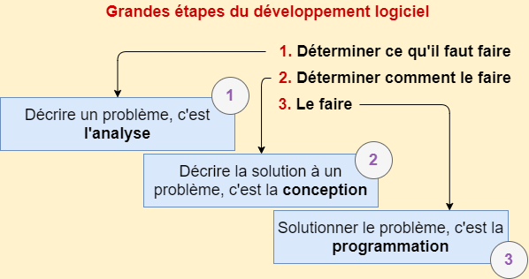
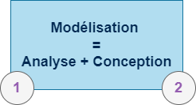
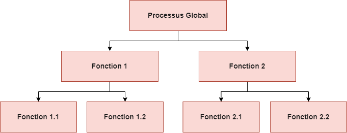

# **Modélisation Orientée Objet (UML)**

## **Introduction**

**Rappel** théorique des grandes étapes du développement logiciel :

> Un **modèle** est une absraction (plus ou moins fidèle) de la réalité

### **Modélisation Fonctionnelle VS MOO**

Le principe de la modélisation fonctionnelle est de décomposer nos tâches een sous-tâches plus simples à réaliser. Cela implique une décomposition "unidirectionnelle" du cahier des charges vers nos sous-programmes

**Exemple :**
- x
- x
- x

## **Objets**
## **Messages**
## **Classes**
## **Relations entre les classes**
## **Héritage**
## **Polymorphisme**
## **Classes abastraites**
## **Interfaces**